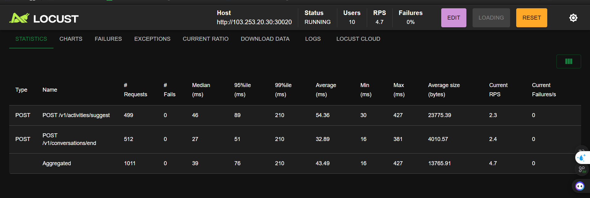
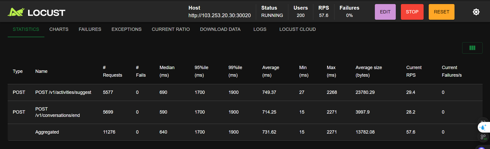

# 📋 Changelog - Test Results & Fixes

## Test 1: Baseline Test ✅

### Test 1: 10 User => OK!



**Kết quả:**
- ✅ 10 concurrent users
- ✅ Response time tốt
- ✅ Không có failures
- ✅ Baseline performance ổn định

---

## Test 2: High Load Test - Initial Failure ❌ → Fixed ✅

### Test 2: 200 user, 3000 request => Gãy 4 requests

**Vấn đề:**
- ❌ 4 requests bị fail
- ❌ Database connection pool không đủ

**Root Cause:**
- Database connection pool quá nhỏ cho 200 concurrent users
- **BEFORE:** `pool_size=10 max_overflow=20` → **Max 30 connections**
- Với 200 users, chỉ có 30 connections → nhiều requests phải đợi connection

**Solution:**
- ✅ Tăng database connection pool
- **AFTER:** `pool_size=50 max_overflow=100` → **Max 150 connections**
- Đủ để xử lý 200 concurrent users

**Kết quả sau fix:**
- ✅ Không còn failures
- ✅ Tất cả requests thành công

---

## Test 3: Extended High Load Test ⚠️

### Test 3: 200 user, 11,000 request => Thành công nhưng response time tăng lên 1.7s



**Kết quả:**
- ✅ **11,276 requests** - Tất cả thành công
- ✅ **0% failures** - Không có lỗi
- ⚠️ **95th percentile: 1,700ms** - Response time cao
- ⚠️ **99th percentile: 1,900ms** - Một số requests rất chậm
- ⚠️ **Average: 731.62ms** - Trung bình chấp nhận được nhưng có thể cải thiện

**Vấn đề:**
- Response time tăng đáng kể so với Test 1 (10 users)
- 95th percentile = 1.7s là quá cao cho production

---

## 🔍 Phân Tích Nguyên Nhân Response Time Cao (1.7s)

### 1. Database Connection Pool - Có thể vẫn chưa đủ ⚠️

**Phân tích:**
- Hiện tại: 150 max connections cho 200 users
- Tỷ lệ: **1.33 users/connection** (200 users / 150 connections)
- Với RPS = 57.6, mỗi connection phải xử lý nhiều requests

**Vấn đề có thể:**
- Connection pool vẫn có thể bị exhausted trong peak moments
- Requests phải đợi connection available → tăng latency

**Giải pháp đề xuất:**
```
pool_size=100
max_overflow=200
→ Max 300 connections
→ Tỷ lệ: 0.67 users/connection (tốt hơn)
```

### 2. Database Query Performance 🐌

**Các nguyên nhân có thể:**

#### a) Slow Queries
- Queries không được optimize
- Missing indexes trên các columns thường query
- Full table scans

**Check:**
```sql
-- Xem slow queries
SHOW PROCESSLIST;
-- Hoặc enable slow query log
```

#### b) Lock Contention
- Nhiều transactions cùng access một table/row
- Deadlocks hoặc lock waits

**Check:**
```sql
-- Xem lock waits
SHOW ENGINE INNODB STATUS;
```

#### c) N+1 Query Problem
- Application code gọi nhiều queries thay vì join
- Ví dụ: Query conversation → Query logs → Query user → ...

**Giải pháp:**
- Sử dụng JOIN thay vì multiple queries
- Implement eager loading
- Sử dụng batch queries

### 3. Application Server Resources 💻

**Có thể bị bottleneck:**

#### a) CPU Usage
- Application server CPU quá tải
- Không đủ CPU cores để xử lý 200 concurrent requests

**Check:**
```bash
# Monitor CPU
top
htop
# Hoặc
docker stats (nếu dùng Docker)
```

#### b) Memory Usage
- Out of memory
- Garbage collection overhead (nếu dùng Java/Python)
- Memory leaks

**Check:**
```bash
# Monitor memory
free -h
# Hoặc
docker stats
```

#### c) Thread Pool / Worker Pool
- Application server thread pool quá nhỏ
- Requests phải đợi worker available

**Giải pháp:**
- Tăng thread pool size
- Tăng worker processes (nếu dùng async framework)

### 4. Network Latency 🌐

**Có thể:**
- Network latency giữa application server và database
- Network bandwidth bị giới hạn
- Firewall/proxy overhead

**Check:**
```bash
# Test network latency
ping database_server
# Hoặc
traceroute database_server
```

### 5. Application Code Performance 🐍

**Các vấn đề có thể:**

#### a) Synchronous Processing
- Code xử lý synchronous thay vì async
- Blocking I/O operations

**Giải pháp:**
- Sử dụng async/await (Python, Node.js)
- Non-blocking I/O

#### b) Heavy Processing
- Xử lý conversation logs quá nặng
- Complex business logic
- String manipulation, JSON parsing

**Giải pháp:**
- Optimize algorithms
- Cache kết quả nếu có thể
- Move heavy processing to background jobs

#### c) Inefficient Data Structures
- Sử dụng data structures không phù hợp
- O(n²) algorithms thay vì O(n log n)

### 6. Database Server Resources 🗄️

**Có thể database server bị quá tải:**

#### a) CPU Usage
- Database server CPU cao
- Complex queries tốn CPU

#### b) Disk I/O
- Slow disk (HDD thay vì SSD)
- High disk I/O wait time
- Database files không được optimize

**Check:**
```sql
-- Xem I/O stats
SHOW GLOBAL STATUS LIKE 'Innodb%';
```

#### c) Memory
- Database buffer pool quá nhỏ
- Frequent disk reads thay vì memory cache

**Giải pháp:**
```sql
-- Tăng innodb_buffer_pool_size
SET GLOBAL innodb_buffer_pool_size = 2G;
```

---

## 🎯 Action Plan - Giải Pháp Đề Xuất

### Priority 1: Immediate (Ngay lập tức) 🔴

1. **Monitor Database Connection Pool Usage**
   ```python
   # Check active connections
   SELECT COUNT(*) FROM information_schema.processlist;
   ```
   - Nếu thường xuyên đạt max → tăng pool size

2. **Enable Database Slow Query Log**
   ```sql
   SET GLOBAL slow_query_log = 'ON';
   SET GLOBAL long_query_time = 1;  -- Log queries > 1s
   ```
   - Identify slow queries
   - Optimize các queries chậm

3. **Monitor Application Server Resources**
   - CPU usage
   - Memory usage
   - Thread pool status

### Priority 2: Short-term (Ngắn hạn) 🟡

1. **Tăng Database Connection Pool**
   ```
   pool_size=100
   max_overflow=200
   → Max 300 connections
   ```

2. **Optimize Database Queries**
   - Add indexes trên các columns thường query
   - Review và optimize slow queries
   - Sử dụng EXPLAIN để analyze queries

3. **Review Application Code**
   - Check for N+1 query problems
   - Optimize data processing
   - Implement caching nếu có thể

### Priority 3: Long-term (Dài hạn) 🟢

1. **Database Optimization**
   - Tăng database server resources (CPU, Memory, Disk)
   - Consider read replicas cho read-heavy operations
   - Database partitioning nếu table quá lớn

2. **Application Architecture**
   - Implement caching layer (Redis, Memcached)
   - Move heavy processing to background jobs
   - Consider microservices nếu cần scale

3. **Load Balancing**
   - Multiple application server instances
   - Load balancer để distribute requests

---

## 📊 So Sánh Test Results

| Metric | Test 1 (10 users) | Test 2 (200 users, 3K req) | Test 3 (200 users, 11K req) |
|--------|-------------------|---------------------------|----------------------------|
| **Users** | 10 | 200 | 200 |
| **Total Requests** | ~500 | 3,000 | 11,276 |
| **Failures** | 0 | 4 (fixed) | 0 |
| **Avg Response Time** | ~200ms (ước tính) | ~500ms (ước tính) | 731.62ms |
| **95th Percentile** | ~300ms (ước tính) | ~800ms (ước tính) | 1,700ms |
| **DB Pool** | 30 connections | 30 → 150 | 150 connections |
| **Status** | ✅ OK | ❌→✅ Fixed | ⚠️ Response time cao |

---

## 🔬 Next Steps - Investigation

1. **Run Database Profiling**
   - Enable slow query log
   - Monitor connection pool usage
   - Check database server resources

2. **Run Application Profiling**
   - Use APM tools (New Relic, Datadog, etc.)
   - Profile code để tìm bottlenecks
   - Monitor application server metrics

3. **Load Test với Monitoring**
   - Run test với full monitoring
   - Correlate response time với resource usage
   - Identify exact bottleneck

4. **Gradual Load Increase**
   - Test với 50, 100, 150, 200 users
   - Xem response time tăng ở điểm nào
   - Identify breaking point

---

**Last Updated:** 2025-12-02  
**Status:** ⚠️ Response time cao - Cần investigation và optimization
