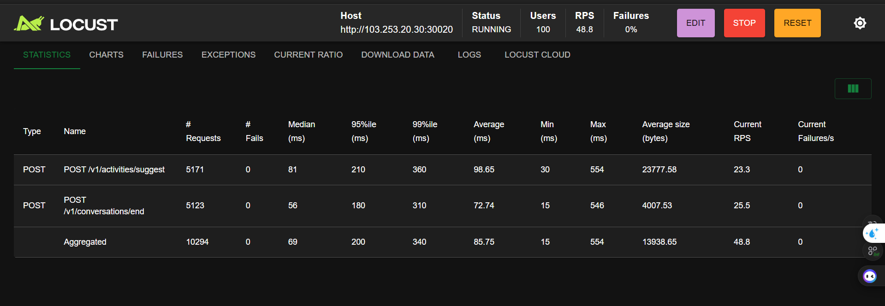

# Sau khi hiểu vấn đề ở phía DB 

```bash
SELECT name, setting, unit
FROM pg_settings
WHERE name = 'max_connections';
```

Khiến cho việc dù đã tăng 

DB_POOL_SIZE=100              # Base connection pool size (default: 50)

DB_MAX_OVERFLOW=200          # Max overflow connections (default: 100, total max = 150)


Nhưng tải vẫn bị dôi time khi có 200 user bắn cùng lúc. 

---

Giải pháp: 1. Là tăng DB connection
Giải pháp test: giảm xuống 100 để test
