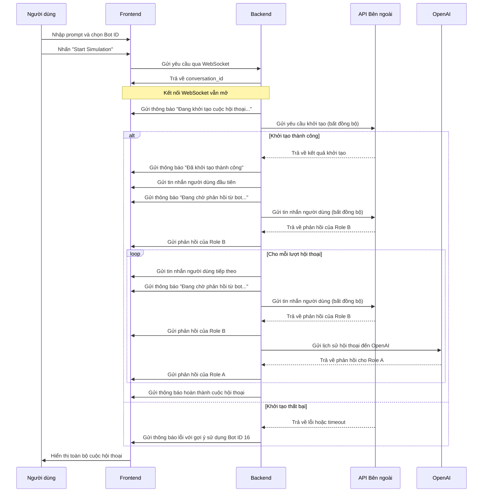

1. Tham khảo code trong @src 
- Code Backend sẽ là 1 API WebSocket. (FastAPI)
Input nhận vào là: 2 Prompt: 1 Prompt của Agent và 1 Prompt giả lập User. 
2 Prompt này bắn qua bắn lại nhau: 
+, Ở version code trong @src thì 2 Prompt này tương tác với nhau và lần lượt tạo nên Conversation. Sau đó được lưu xuống file excel theo từng dòng với RoleA, RoleB. 
+, Ở version update này: 2 Prompt sẽ bắn nhau ở dưới Backend và WebSocket lên UI. 

2. Frontend: - Lovable.dev + Purcode
---
UI (JSX/TSX + TypeScript) sẽ là: 
1. 2 Prompt được nhập ở 2 ô. 
2. 1 Button "Start" để bắt đầu. 
3. 1 ô chứa Conversation được hiển thị ở dưới. 
Từng dòng từng dòng được hiển thị lên. 

=======
## Cho qua lovable:


---
ChatGPT để define kỹ UI hơn. 


============


## Luồng dữ liệu chi tiết

```
Frontend                   Backend                         API bên ngoài            OpenAI
   |                          |                                |                       |
   | Khởi tạo cuộc hội thoại  |                                |                       |
   |------------------------->|                                |                       |
   |                          | Khởi tạo cuộc hội thoại        |                       |
   |                          |------------------------------->|                       |
   |                          |<-------------------------------|                       |
   |<-------------------------|                                |                       |
   |                          |                                |                       |
   |                          | Gửi tin nhắn ban đầu           |                       |
   |                          |------------------------------->|                       |
   |                          |                                |                       |
   |                          | Nhận phản hồi từ Role B        |                       |
   |                          |<-------------------------------|                       |
   |                          |                                |                       |
   | Hiển thị phản hồi Role B |                                |                       |
   |<-------------------------|                                |                       |
   |                          |                                |                       |
   |                          | Gửi lịch sử hội thoại          |                       |
   |                          |------------------------------------------------------>|
   |                          |                                |                       |
   |                          | Nhận phản hồi cho Role A       |                       |
   |                          |<------------------------------------------------------|
   |                          |                                |                       |
   | Hiển thị phản hồi Role A |                                |                       |
   |<-------------------------|                                |                       |
   |                          |                                |                       |
   |                          | Gửi phản hồi Role A            |                       |
   |                          |------------------------------->|                       |
   |                          |                                |                       |
   |                          | Nhận phản hồi từ Role B        |                       |
   |                          |<-------------------------------|                       |
   |                          |                                |                       |
   | Hiển thị phản hồi Role B |                                |                       |
   |<-------------------------|                                |                       |
   |                          |                                |                       |
   |        ... Lặp lại cho đến khi đạt số lượt tối đa ...    |                       |
```


