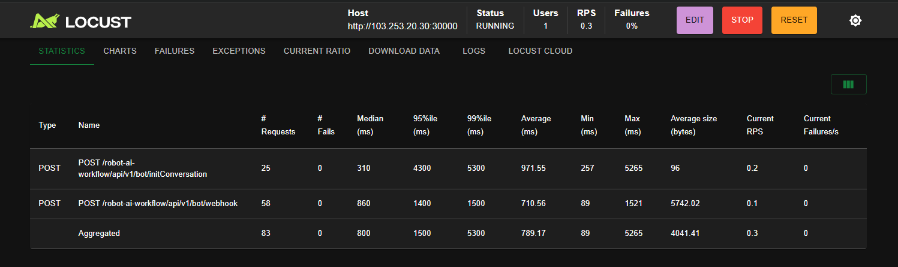
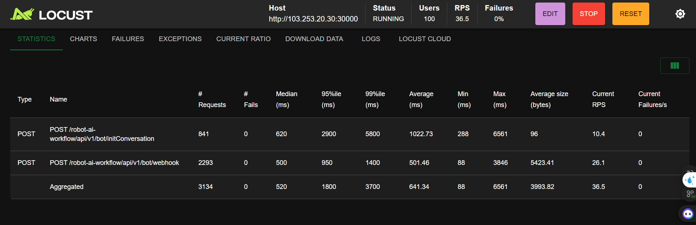

---


Dựa đúng vào API `initConversation` bạn đang gọi:

```bash
curl --location 'http://103.253.20.30:30000/robot-ai-workflow/api/v1/bot/initConversation' \
  --header 'Content-Type: application/json' \
  --header 'accept: application/json' \
  --data '{
    "bot_id": 646,
    "conversation_id": "b87be6b6-395d-4b13-9748-05d119e03036_40647ede-651d-4c63-965d-75bf398d9af7",
    "user_id": "019ac33e-4ee0-7d55-8e92-2790cad8a8c3",
    "input_slots": {}
  }'
```

thì hai API external đang được gọi bên trong là:

- `URL_PROFILE=https://robot-api.hacknao.edu.vn/robot/api/v1/llm`
- `TOKEN_PROFILE=b1812cb7-2513-408b-bb22-d9f91b099fbd`

### 1. API `user_profile`

```bash
curl --location -G 'https://robot-api.hacknao.edu.vn/robot/api/v1/llm/user_profile' \
  --data-urlencode 'conversation_id=b87be6b6-395d-4b13-9748-05d119e03036_40647ede-651d-4c63-965d-75bf398d9af7' \
  --data-urlencode 'token=b1812cb7-2513-408b-bb22-d9f91b099fbd' \
  --header 'Accept: application/json'
```

### 2. API `activity_name`

```bash
curl --location -G 'https://robot-api.hacknao.edu.vn/robot/api/v1/llm/activity_name' \
  --data-urlencode 'conversation_id=b87be6b6-395d-4b13-9748-05d119e03036_40647ede-651d-4c63-965d-75bf398d9af7' \
  --data-urlencode 'token=b1812cb7-2513-408b-bb22-d9f91b099fbd' \
  --header 'Accept: application/json'
```

Chỉ cần thay `conversation_id` (và `token` nếu đổi trong `.env`) là test được riêng từng API.

---

* Trên server 30: 2 cái API bên ngoài user_profile và activity_name lúc thì 300ms lúc thì 2-3s
* Còn trên localhost: thì siêu nhanh 200-300ms

---


vv Stress Test Robot Workflow (chưa done)

100 user, 8000 requests

Hiện tại khi dùng Groq:

* init conversation P99 = 5s (nguyên nhân do phía server 30 call tới API bên ngoài là 1 API phía BE nút thắt ở: 1. Là do tải ở API bên ngoài  2. Là do vấn đề mạng chậm của server )
* webhook (luồng học) P99 = 1.4s
* 

---


