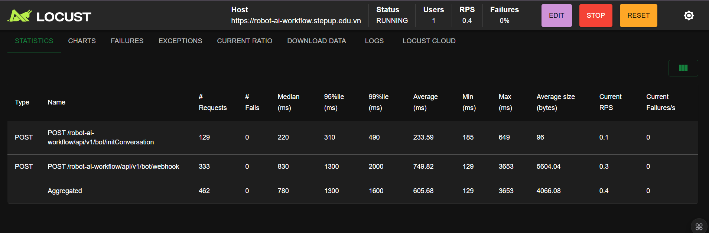
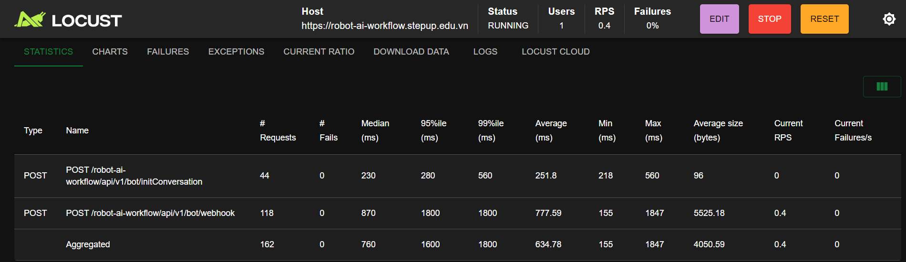
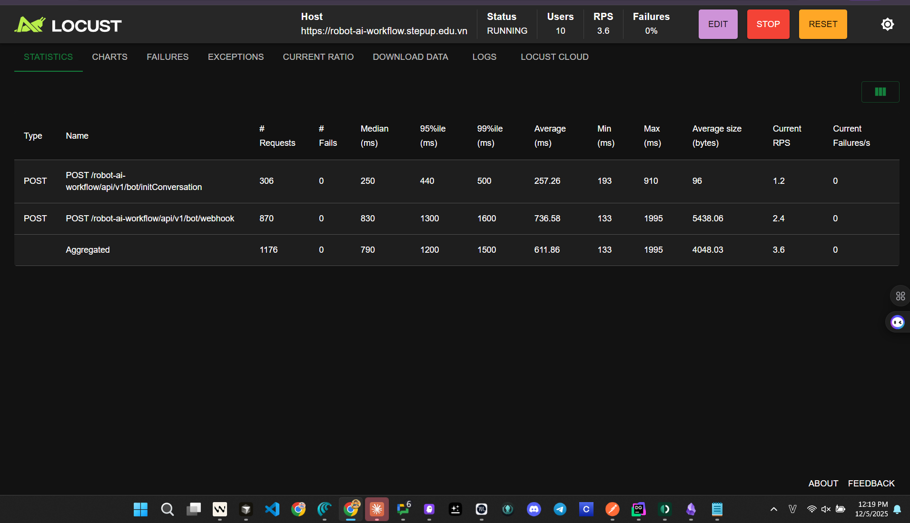

## 1.1: 1 worker - 1 CCU - base line

---

## 1.2 10 worker - 1 CCU - base line 

## 1.3 10 worker - 10 CCU 

## 1.4 100 worker - 100 CCU 

---

 Cách thức test:

* Test 2 API Init, Webhook
* Các bài đem test: API random 10 bài học được lấy từ chỗ chị Dương (đó là các bài mới nhất đã được `pass QC` đẩy Production

---
